# Update 9 - Luminance (Y)  channel noise filter and edge enhancement

After YUV conversion, the luminance (Y)  channel is noise-filtered to suppress high-frequency grain. This noise typically originates from dark current or readout noise, which becomes prominent when the Signal-to-Noise Ratio (SNR) is low—most notably in night-vision applications requiring high gain and extended exposure times. Even in daylight, flat regions like the sky can exhibit artifacts caused by photon shot noise. For ISP tuning, the primary challenge is balancing noise alleviation with detail preservation [[Digital Camera Technologies for Scientific Bio-Imaging. Part 3: Noise and Signal-to-Noise Ratios](https://analyticalscience.wiley.com/content/news-do/digital-camera-technologies-scientific-bio-imaging-part-3-noise-and-signal-to-noise)].

In this implementation, a [non-local mean (NLM) filter](https://www.ipol.im/pub/art/2011/bcm_nlm/) was chosen because internal testing demonstrated superior edge preservation compared to the Bilateral Filter. The screenshots below illustrate performance in outdoor scenes under varying lighting conditions. While we initially utilized the standard OpenCV recommendations (`h=10, templateWindowSize=7, searchWindowSize=21`), further fine-tuning was required to retain high-frequency details. Using a custom Python-based GUI to iterate through parameters, we identified optimal settings (`h=2, templateWindowSize=3, searchWindowSize=11`) for daylight outdoor scenes that effectively maintain fine structures, such as distant tree branches

**Outdoor, night vision, Y channel only**

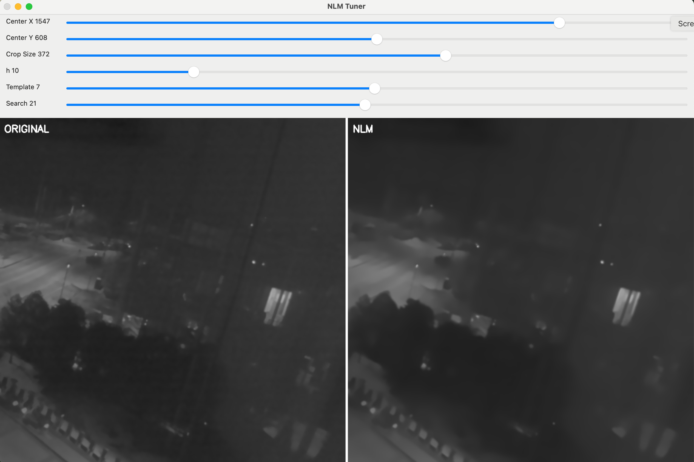

cv.fastNlMeansDenoising(), h=10, templateWindowSize=7, searchWindowSize=21

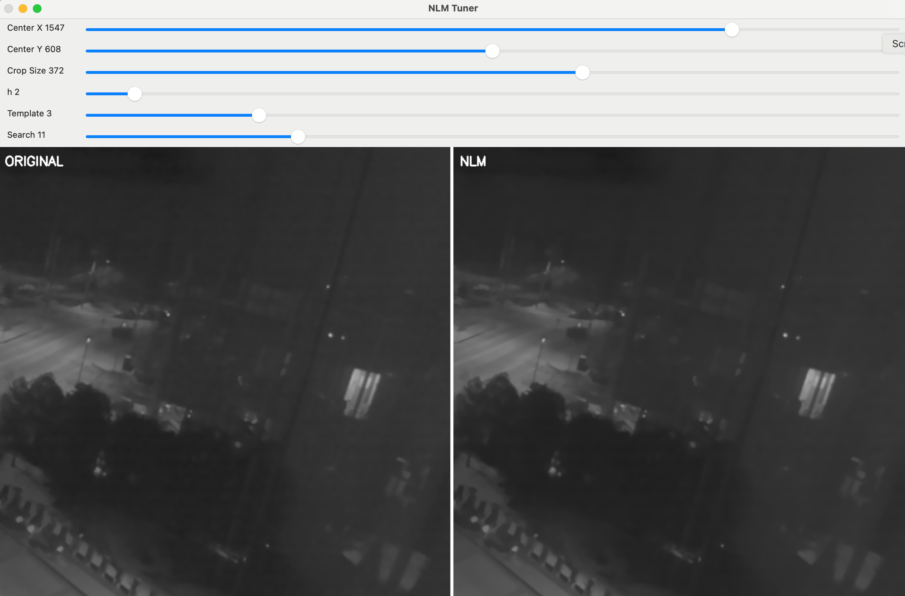

cv.fastNlMeansDenoising(), h=2, templateWindowSize=3, searchWindowSize=11

**Outdoor, daylight, Y channel only**

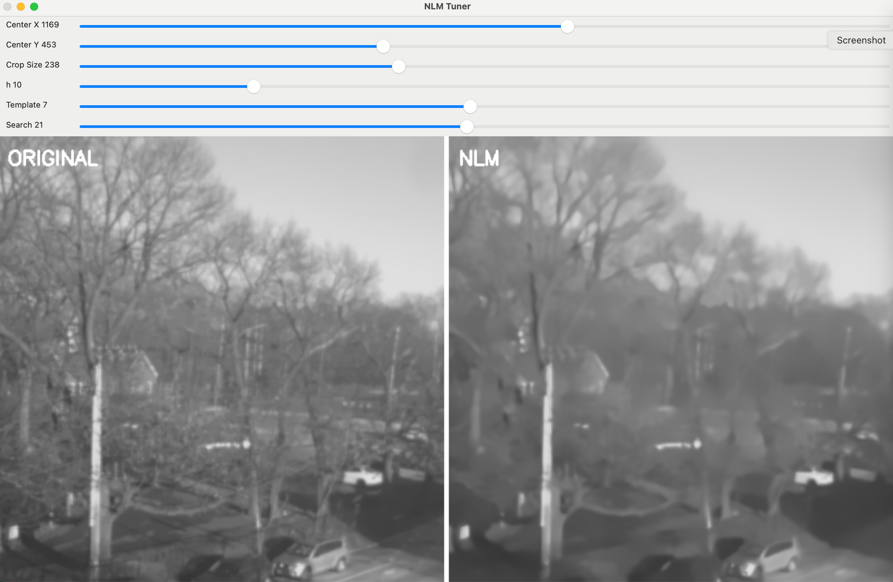

cv.fastNlMeansDenoising(), h=10, templateWindowSize=7, searchWindowSize=21

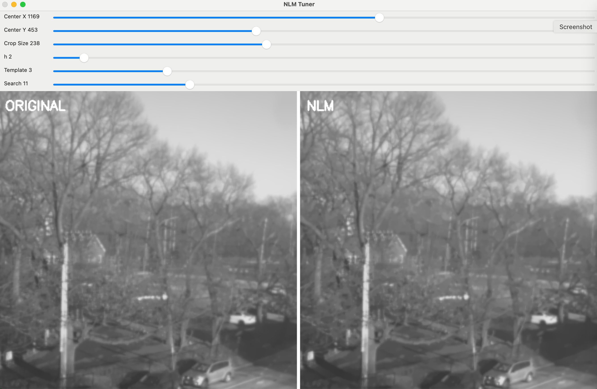

cv.fastNlMeansDenoising(), h=2, templateWindowSize=3, searchWindowSize=11

While NLM filtering effectively suppresses noise, the non-ideal nature of the filter introduces spatial blurring and reduces edge contrast. To recover these details, Laplacian-based edge enhancement with a soft-thresholding coring strategy was employed. The coring function below applies a non-linear gain ramp to prevent the 'ringing' typically associated with steep Laplacian transitions.

$Y_{sharpened}=Y_{original}+M({\mid}E{\mid})*gain$

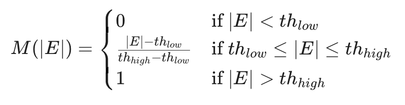

To specifically address 'beading artifacts'—where fine 1–2 pixel structures break into pixelated features due to high-frequency noise amplification—a 3x3 median filter was integrated into the edge processing. This median filter acts as a spatial outlier rejection step, suppressing isolated noise spikes in the edge map while preserving the structural continuity of thin tree branches. The result is a significant enhancement of branch outlines with a marked reduction in granular artifacts

**Edge enhanced without median filter, Outdoor, daylight, Y channel only**

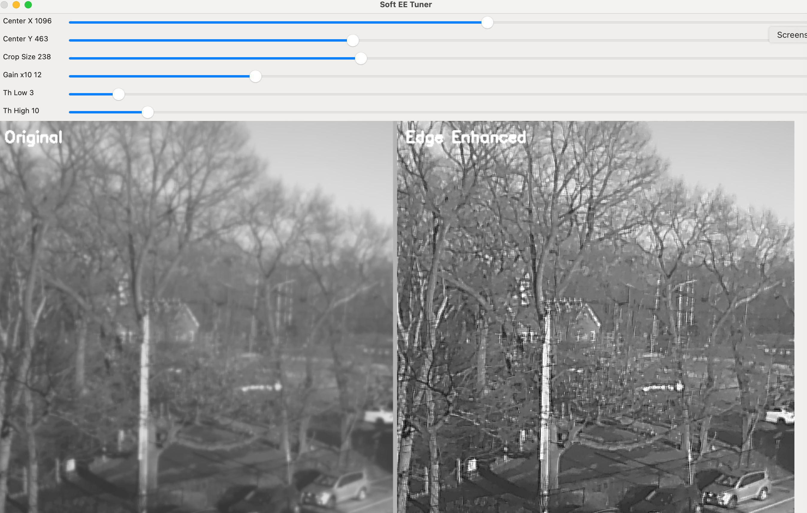

Edge enhancement without 3x3 median filter

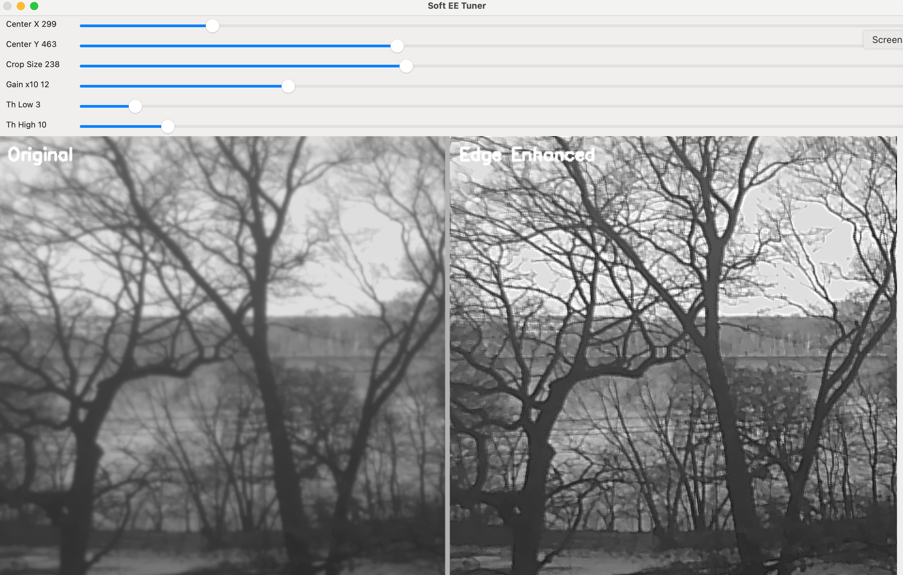

Edge enhancement without 3x3 median filter

**Edge enhanced with median filter, Outdoor, daylight, Y channel only**

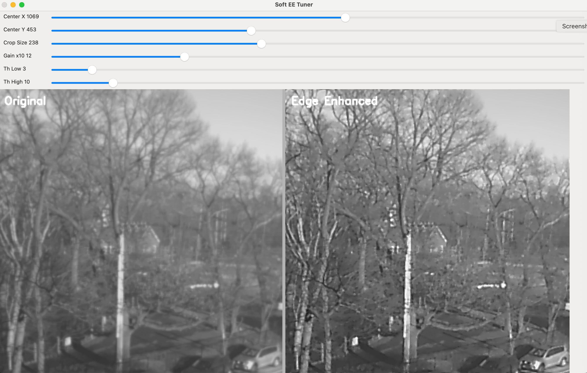

Edge enhancement with 3x3 median filter

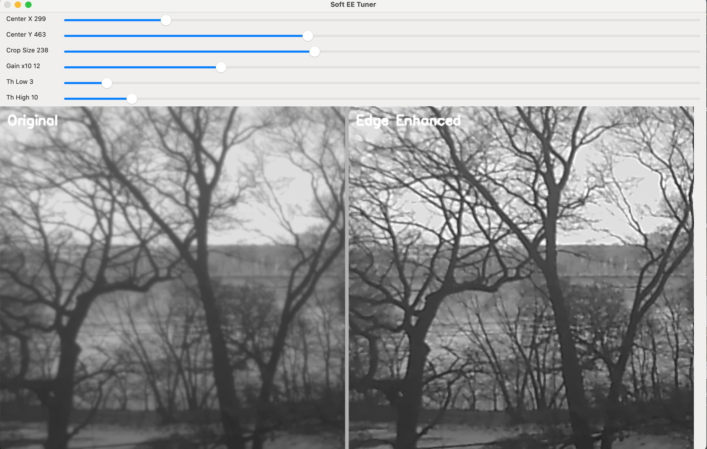

Edge enhancement with 3x3 median filter

**Edge enhanced with median filter, Outdoor, Night vision (Exp 16ms, Gain 6), Y channel only**

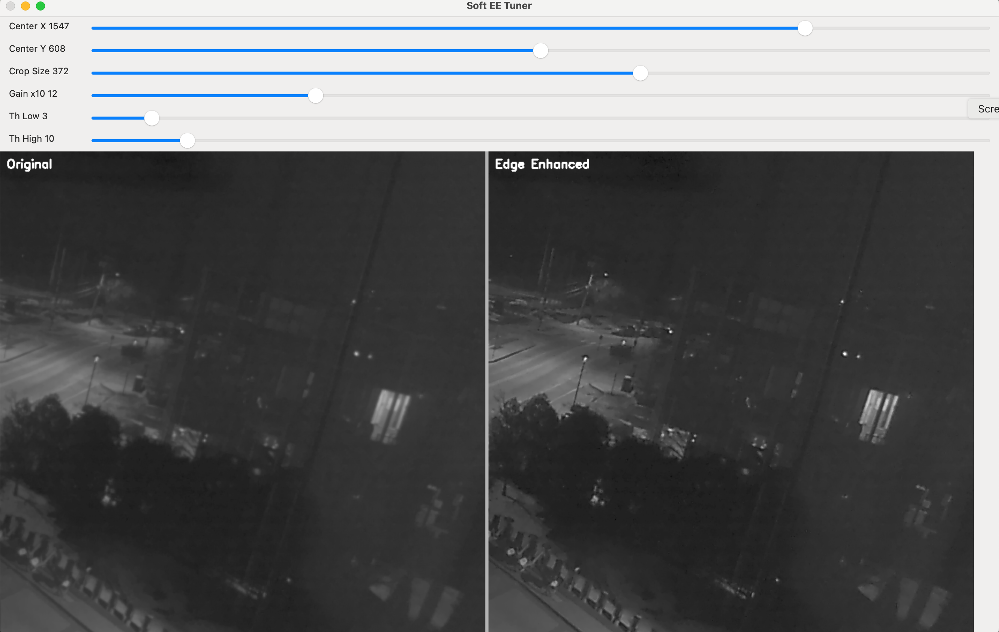

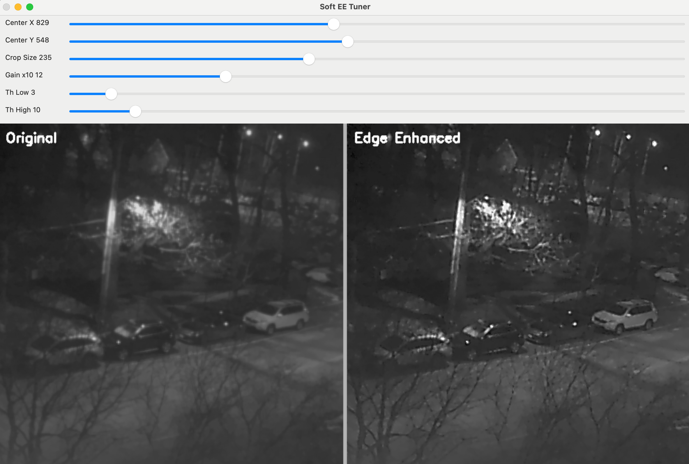

---