# Display performance measurement

by Taehwang Son

## 1. Goal

- Accurately compute **CIE 1931 XYZ tristimulus values** from a monitor’s display using spectral measurements and the **CIE 1931 2° standard observer** color matching functions.
- Evaluate the monitor’s **chromaticity accuracy** by comparing the measured chromaticities of ColorChecker patches against known **sRGB reference values**.
- Apply a **Color Correction Matrix (CCM)** to compensate for errors due to the uncalibrated spectrometer, optimizing the transform in **CIELAB** space.
- Quantify color reproduction accuracy using  $\Delta E_{ab}^*$ and  $\Delta E_{uv}^*$ metrics in **CIELAB** and **CIELUV** spaces, respectively.
- Determine **sRGB gamut coverage** by comparing the chromaticity triangle formed by the measured RGB primaries against the reference sRGB triangle in **CIE 1976 u′v′** space.

---

## **2. Materials and methods**

- **Spectral Power Distribution (SPD) Measurement:**
    
    Acquired using a 600 μm multimode fiber-coupled USB spectrometer (radiometrically uncalibrated), positioned to capture light from the display surface.
    
- **Test Pattern:**
    
    A CIE 24 Color Checker image is displayed on the target screen as the measurement reference set. See Sec. 4-a) for details.
    
- **Colorimetric Calculation:**
    
    Convert measured SPD data to CIE 1931 XYZ tristimulus values using the CIE 1931 2° standard observer color matching functions.
    
- **Data Analysis and Prototyping Environment:**
    
    Analysis and chromaticity calculations are performed in a Jupyter Notebook using the [**Colour Science Python module**](https://www.colour-science.org/).
    

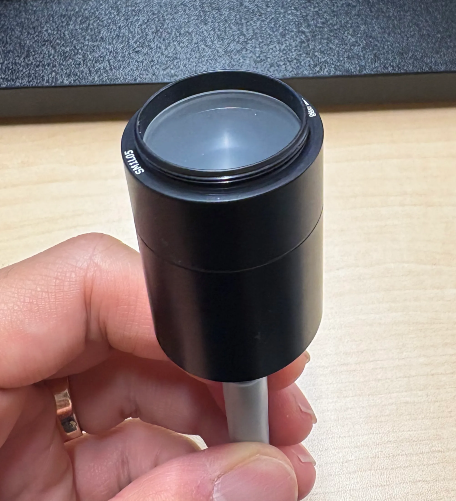

Multimode fiber end with a diffuser

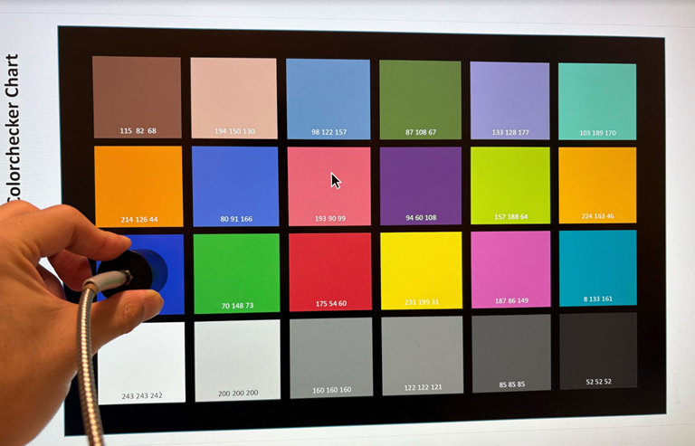

24 Color checker measurement with multimode fiber

---

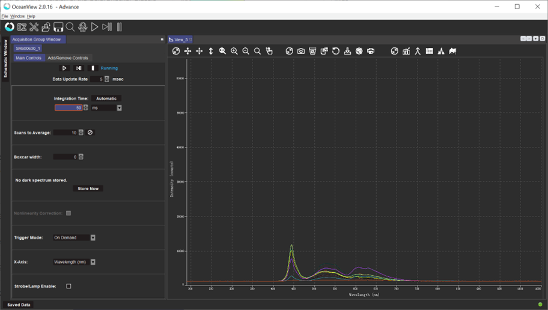

Raw data acquisition using Ocean Optics USB spectrometer 

### XYZ tristimulus calculation

The XYZ values are computed by integrating the measured Spectral Power Distribution (SPD) with the CIE 1931 2° Standard Observer color matching functions (CMFs) across the visible wavelength range

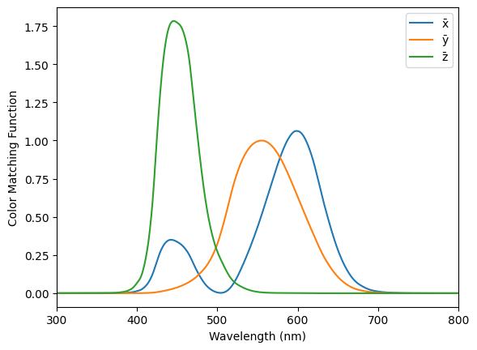

X = ∑ S(λ) · x̄(λ) · Δλ

Y = ∑ S(λ) · ȳ(λ) · Δλ

Z = ∑ S(λ) · z̄(λ) · Δλ

Where:

- S(λ): Spectral Power Distribution of the 24 color checker
- x̄(λ), ȳ(λ), z̄(λ): CIE 2° Color Matching Functions
- Δλ: Wavelength interval

### CIE 1931 xy chromaticity

Chromaticity coordinates (x, y) are calculated by normalizing XYZ:

$x = \frac{X}{X + Y +Z}$

$y = \frac{Y}{X + Y +Z}$

### CIE 1976 L* u*v* chromaticity

Conversion from XYZ to  CIE 1976 L* u*v*:

$L^*=116(\frac{Y}{Y_n})^{1/3}-16$

$u^* = 13L^*(u'-u'_n)$

$v^* = 13L^*(v'-v'_n)$

- subscripted n denotes the values from white illuminant

### CIE 1976 u'v' chromaticity

Conversion from XYZ to CIE 1976 u′v′:

$u' = \frac{4X}{X+15Y+3Z}$

$v' = \frac{9Y}{X+15Y+3Z}$

### CIE 1976 L* a*b* chromaticity

Conversion from XYZ to  CIE 1976 L* a*b*:

$L^*=116(\frac{Y}{Y_n})^{1/3}-16$

$a^* = 500[(\frac{X}{X_n})^{1/3} - \frac{Y}{Y_n})^{1/3}]$

$b^* = 200[(\frac{Y}{Y_n})^{1/3} - \frac{Z}{Z_n})^{1/3}]$

- subscripted n denotes the values from white illuminant

---

## 3. Results

### a) CIE 1931 xy chromaticity diagram

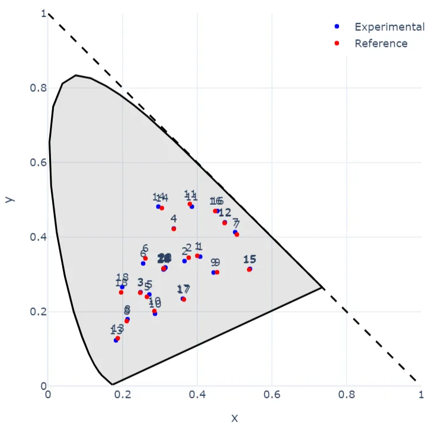

Dell P2715Q monitor xy chromaticity 

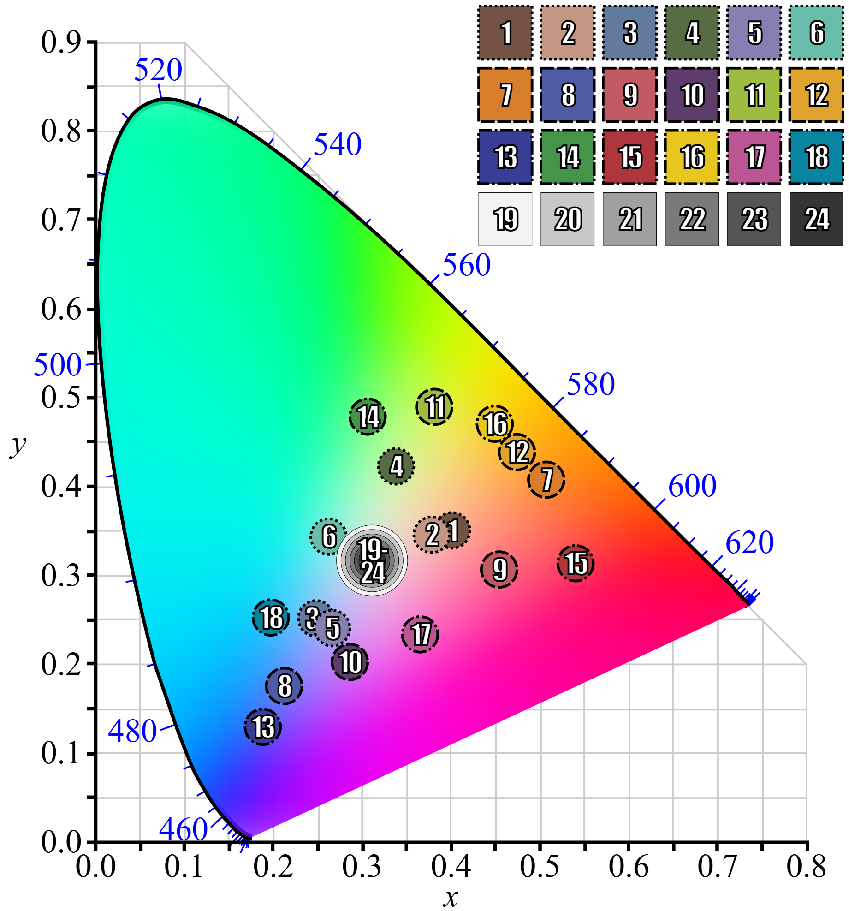

Reference data [Wikipedia: Color Checker](https://en.wikipedia.org/wiki/ColorChecker)

The x, y chromaticities of the 24 ColorChecker patches were measured. Display color performance is often evaluated using $\Delta {E_{a b}}^{\ast}$ instead of directly comparing xy coordinates. This is because color spaces like CIELUV or CIELAB offer improved perceptual uniformity, where Euclidean distance corresponds more closely to perceived color differences. Therefore, the measured xy coordinates must be converted into the CIELUV space for this analysis [reference]. The calculation of $\Delta {E_{a b}}^*$ will be discussed in Sec. 3-c).

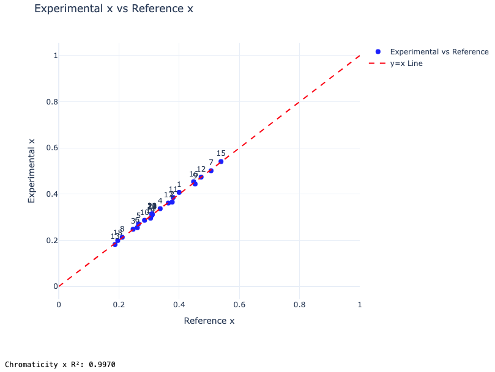

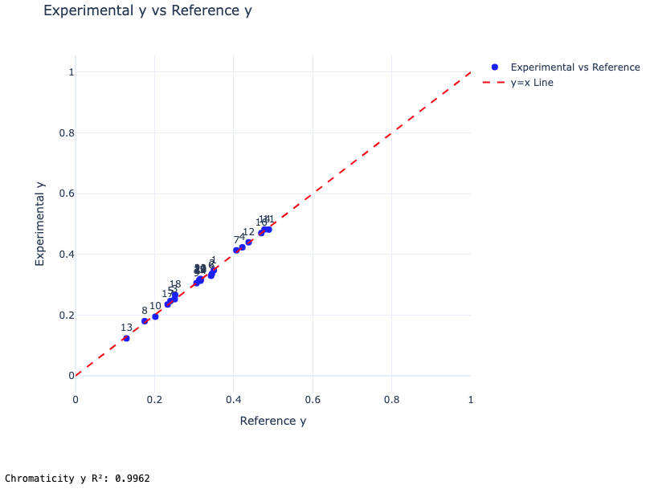

Experimentally acquired x, y and reference x, y values are plotted with a y = x line. Both x and y values match well with reference values, and $R^2$ values were calculated to be > 0.99

### b) Luminance and RGB value relationship

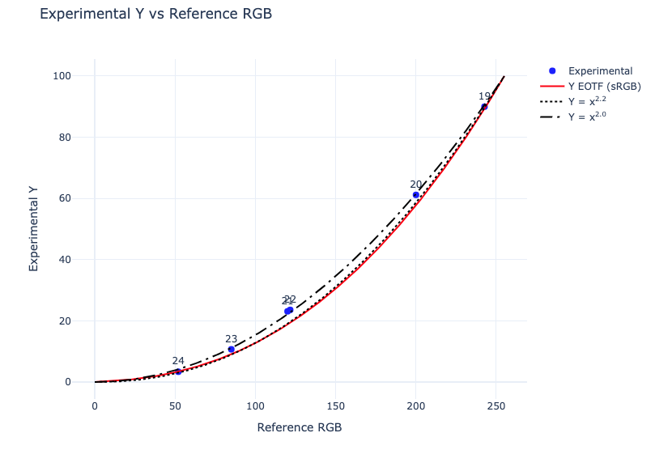

The monitors I measured have an sRGB color space, meaning the luminance response follows the sRGB electro-optical transfer function (EOTF). This function is characterized by a linear segment at low brightness levels (to avoid harsh banding near black) and a power-law (gamma) segment for mid and high brightness levels, approximating a gamma of about 2.2 for most of the range [2]. The following equation is used to decode (linearize) sRGB pixel values into linear RGB values:

For each channel $C_{linearRGB}$:

$C_{linearRGB}=\frac{C_{sRGB}}{12.92}$                       if $C_{sRGB} ≤ 0.04045$

$C_{linearRGB}=[\frac{C_{sRGB}+0.055}{1.055}]^{2.4}$       if $C_{sRGB} > 0.04045$

where $C_{linearRGB}$ and $C_{sRGB}$ are normalized between 0 and 1.

Accoding to ITU-R Recommendation BT.709 standard RGB to XYZ linear transformation, Luminance Y can be calculated as below:

$Y = 0.2126R+0.7152G+0.0722B$ 

Note that the “White” patch (Patch 19) was used for luminance calibration. The data from patches 19–24 were plotted together with the previously mentioned sRGB EOTF, as well as the gamma curves $Y={C_{sRGB}}^{2.2}$ and  $Y={C_{sRGB}}^{2.0}$. The measured luminance values for patches 20–23 were noticeably higher than the sRGB EOTF and gamma 2.2 reference, but closely followed the $Y={C_{sRGB}}^{2.0}$curve. This strongly suggests that the Dell P2715Q may not strictly follow gamma 2.2 or the sRGB EOTF. It is  known that some consumer monitors intentionally adjust their gamma curves to make midtones appear brighter or to compensate for panel characteristics and typical viewing conditions [ref]. Additionally, the monitor’s “factory reset” or “standard” mode may not be intended for accurate color representation.

### c) CIE 1976 u'v' chromaticity  diagram

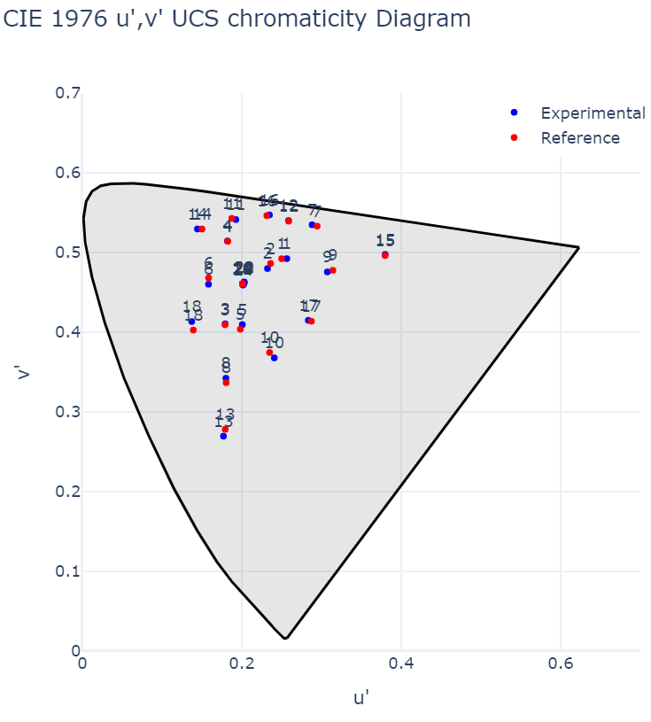

Dell P2715Q monitor u’v’ chromaticity 

Even though CIE 1931 color diagram is used in many color applications, it is known that it is not appropriate to present quantitative color difference in Eucldean coordinates. Instead, CIE 1976 u’v’ and CIE 1976 L*, a*, b* are often employed for uniform distribution in the color spaces. Above diagram shows u’ v’ chromaticies of 24 patches on the color checker.

For quantitative color difference analysis,  $\Delta {E_{a b}}^{\ast}$ can be calculated from two points $(L_1^{\ast}, a_1^{\ast}, b_1^{\ast})$and $(L_2^{\ast}, a_2^{\ast}, b_2^{\ast})$ in CIE 1976 L{\ast}, a{\ast}, b{\ast} spaces:

$\Delta {E_{a b}}^{\ast} = [(L_2^{\ast}-L_1^{\ast})^2 +(a_2^{\ast}-a_1^{\ast})^2+(b_2^{\ast}-b_1^{\ast})^2]$ 

Since a radiometically uncalibrated spectrometer was used for the measurement, adjustment step was required. 3x3 matrix XYZ linear transform is used for making a color correction matrix (CCM) [1]. I measured XYZ from the first Dell P2715Q monitor and did least square opmitization to find M minimize $\Delta {E_{a b}}^{\ast}$compared to color checker reference values.

Second monitor XYZ values were transformed using obtained M and coverted to LAB to compared with reference value. the mean $\Delta {E_{a b}}^*$ from 24 color checker for the second monitor was calculated to be 2.80, [which is within the manufacturer’s spec, 3](https://www.amazon.com/Dell-Monitor-P2715Q-27-Inch-LED-Lit/dp/B00PC9HFO8?th=1). Considering the fact that uncalibrated spectrometer was used, the measured value is quite great.

The other observation could be comparsion between the first and second monitor. $\Delta {E_{a b}}^*$ from the two monitors was 1.27, which is also below the manufacturer specification. It showed that uncalibrated spectrometer can also be used for display performance test.

### d) sRGB Gamut coverage

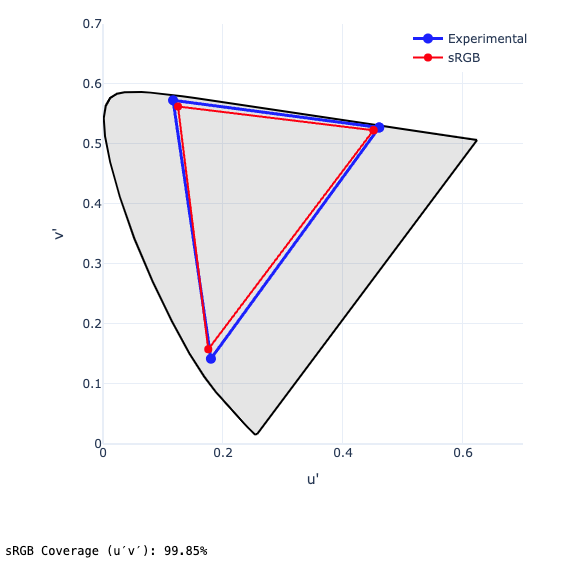

sRGB gamut coverage was determined by measuring the chromaticity coordinates of the red, green, and blue primaries. For example, the red primary corresponds to the RGB value [255, 0, 0]. To approximate these values, I displayed large rectangular patches in PowerPoint, assigning specific RGB values to each primary color.

Once the chromaticity coordinates were measured, both the experimental and reference sRGB triangles were constructed in a chromaticity diagram (e.g., CIE 1976 u′v′). The sRGB coverage was then calculated as the ratio of the intersection area to the reference sRGB triangle area:

$Coverage (\%) = \frac{Area(intersection)}{Area(sRGB)}\times 100$  

The calculated sRGB coverage was 99.85%, which exceeds the manufacturer’s specification of 99%. This suggests the display is highly accurate in reproducing sRGB colors.

## 4. Challenges and Limitations

### a) Lack of 24-color checker images

I found [a PDF version of the color checker](https://en.wikipedia.org/wiki/File:Color_Checker.pdf), but I realized that the RGB values for the 21 Neutral 6.5 position are incorrect. The 21st position is darker than the 22nd position.

Using Python Dash, I made a simple GUI-based application for generating color checker images. [**ColorChecker-App** GitHub page](https://github.com/taehwangson/ColorChecker-App)

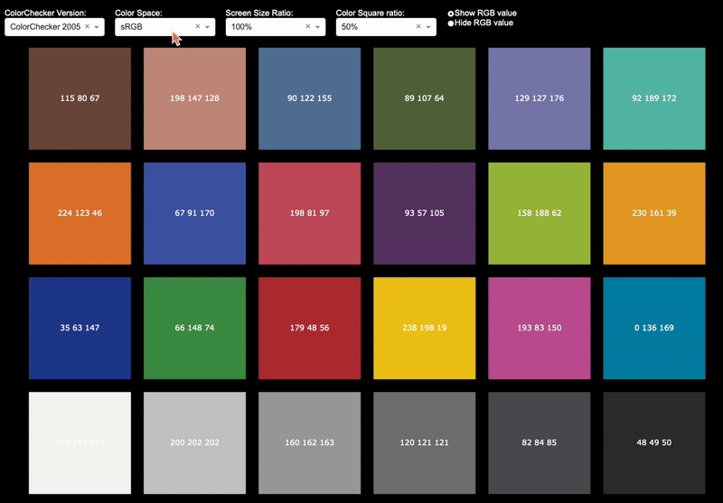

### b) Color Correction Matrix (CCM)

To compute accurate tristimulus values, the spectral power distribution (SPD) should ideally be expressed in units of radiance (W·sr⁻¹·m⁻²·nm⁻¹) or at least in relative radiometric terms. However, in this experiment, an uncalibrated spectrometer was used. As a result, the raw spectral data may be distorted by the sensor's spectral sensitivity or response function, and therefore may not accurately represent true radiance, even if some basic compensation steps were applied. To mitigate these spectral distortions and map the measured data to perceptually accurate color values, a color correction matrix (CCM) is required [1].

To compensate for this discrepancy and improve the perceptual accuracy of color reproduction, CCM was computed. The correction matrix was optimized by minimizing the color difference in CIELAB space between the reference color values and the transformed values derived from the measured XYZ data. Specifically, a 3×3 matrix was fitted to transform the measured XYZ values such that the resulting LAB values closely match the reference LAB values.

The optimization was performed using a nonlinear least-squares method, where the objective function minimizes the total squared color error in CIELAB space.

$XYZ_{corrected}^i = M \times XYZ_{measured}^i$

$argmin_{M} \Sigma_{i}^{N} {\parallel}CIELAB(M\times X_{measured}^i - CIELAB_{ref}^i){\parallel}^2$

---

Where:

- $XYZ_{measured}^i$ is the measured (uncorrected) XYZ vector of patch i
- $CIELAB_{ref}^i$is the known reference CIELAB value
- CIELAB (⋅) is the conversion from XYZ to CIELAB (using the same white point)
- ∥⋅∥is the Euclidean norm in CIELAB space
- N is the number of color patches, 24.

---

## (5) References

[1] "Digital Color Management: Encoding Solutions," Second Edition, by Edward J. Giorgianni et al.

[2] "High Dynamic Range Imaging: Acquisition, Display, and Image-Based Lighting," Second Edition, by Erik Reinhard et al.

[3] "Color Appearance Models," Third Edition, by Mark D. Fairchild.

[4] https://www.imatest.com/docs/colortone_ref/

<!-- 
  -->