# Primary and Chromatic Aberration Control

This project focuses on the fundamental principles of aberration correction, exploring how lens bending, aspherization, and glass selection can be used to eliminate spherical aberration, coma, and chromatic focal shifts.

# Singlet Lens Optimization (Spherical vs. Aspheric)

- **Specs:** f=4.33 mm, F/1 speed (NA=0.5).
- **Design Approach:** Evaluated a standard BK7 plano-convex lens against an optimized hyperbolic version where the conic constant was set to the squared refractive index (K=−n2). Further refined the design using a general asphere with 6th, 8th, and 10th-order coefficients to minimize RMS spot size.
- **Outcome:** Corrected over **580 waves** of spherical aberration to near-zero. Analysis showed that while aspherics effectively eliminate on-axis spherical aberration, significant coma remains at off-axis fields (1.62 waves at 0.5∘) unless the system is balanced via lens bending or by increasing the refractive index to an aplanatic condition (n=1.8034).
  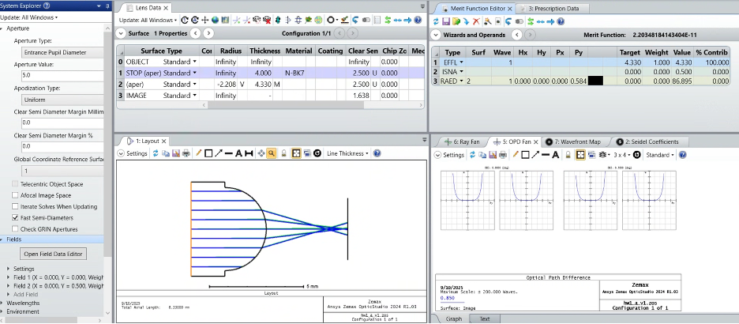
  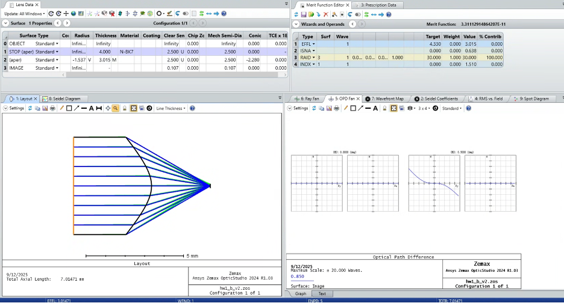
  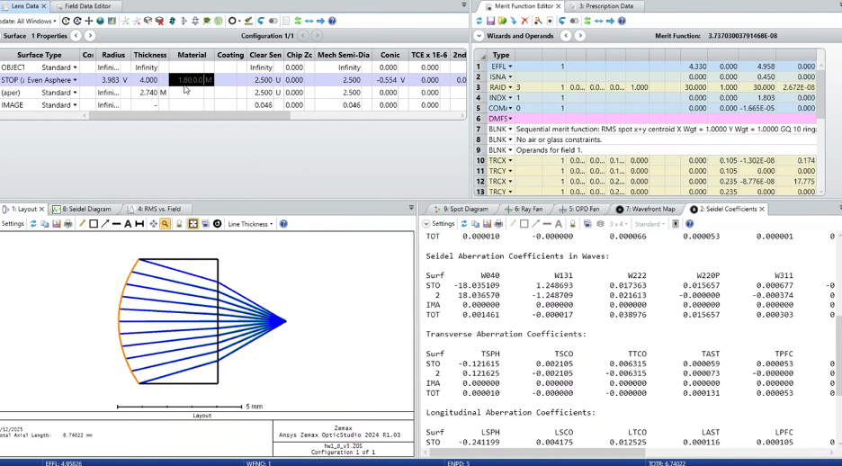

# Lens Bending and Splitting Strategies

- **Specs:** f=100 mm, F/4 BK7 singlet.
- **Design Approach:** Performed a trade study on the "Shape Factor" to find the bending that minimizes third-order spherical aberration (W040​). Compared the performance of a single optimized lens against a "split" design using two lower-power plano-convex elements.
- **Outcome:** Demonstrated that splitting the optical power between two elements reduces residual spherical aberration from **9.6 waves to 3.4 waves RMS**. Validated that aspherizing either the front or rear surface of a singlet can reduce W040​ to zero, though rear-surface aspherization is more effective for longer radii.
  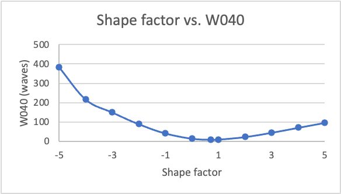
  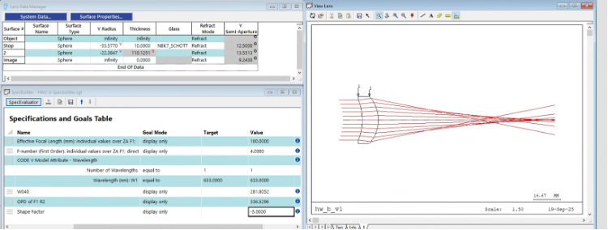
  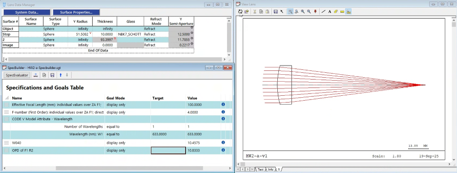
  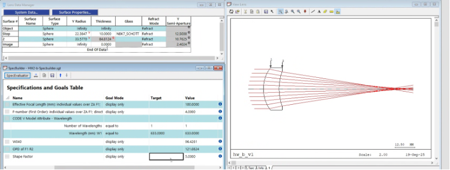

# Achromatic and Apochromatic Design

- **Specs:** f=2400 mm (F/12) and f=1200 mm (F/12).
- **Design Approach:** Designed a cemented doublet using BK7 and F4 glass to correct longitudinal axial color. Advanced to an **apochromatic triplet** (FPL53, NBK7, and NBAF52) using glass dispersion modeling to ensure the chromatic focal shift curve crossed zero at three distinct wavelengths.
- **Outcome:** The achromatic doublet reduced the secondary spectrum by an **order of magnitude** compared to a singlet. The apochromatic triplet achieved an aplanatic condition (W040​ and W131​ near zero) with an RMS wavefront error of **0.04 waves**, providing diffraction-limited performance over a 0.5∘ full field.
  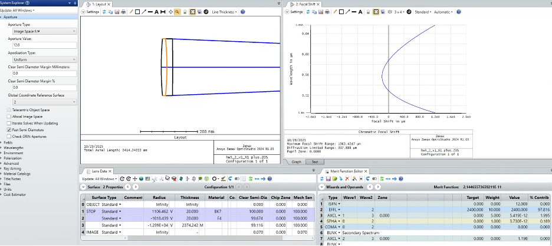
  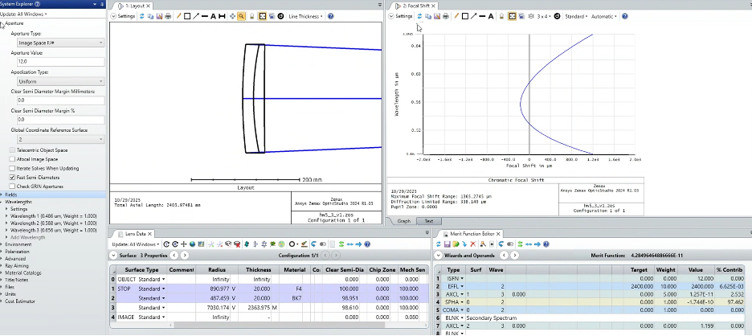
  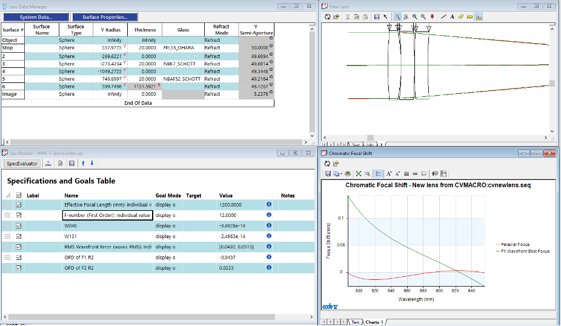
  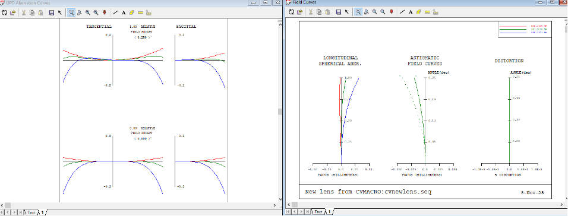

# Achromatization using Buried Surfaces

- **Specs:** f=100 mm, F/12, ±0.25∘ field.
- **Design Approach:** Utilized a "buried surface" architecture with a pair of index-matched glasses (same refractive index but different V-numbers). This allowed the shape factor to control spherical aberration and coma while the dispersive power difference at the internal interface corrected chromatic aberration.
- **Outcome:** Successfully created an aplanatic and achromatic doublet with an RMS wavefront error of **0.02 waves**, significantly below the diffraction limit criteria.
  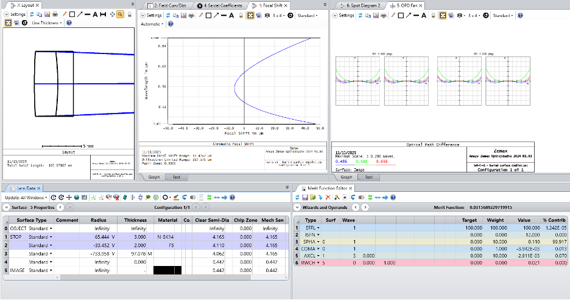