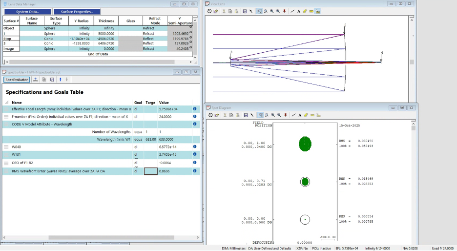
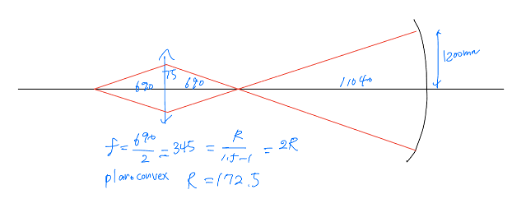
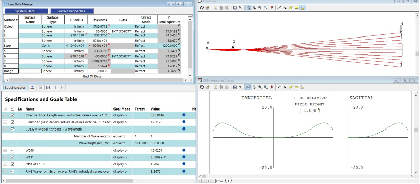
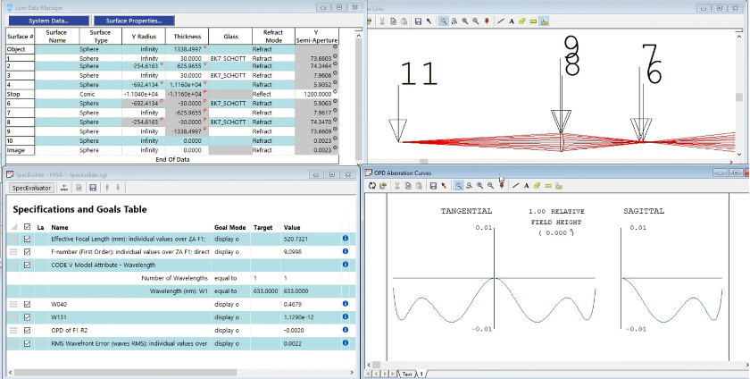
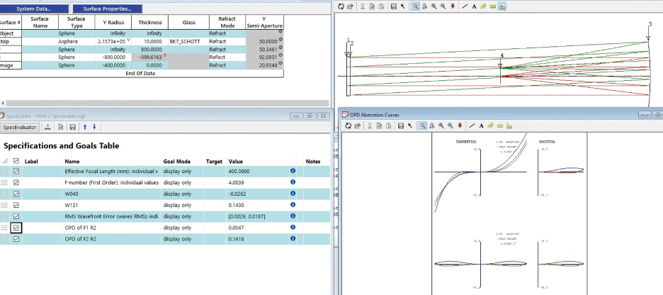
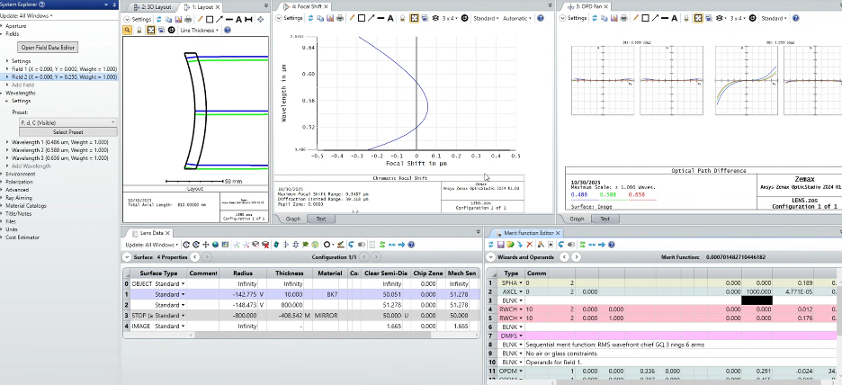
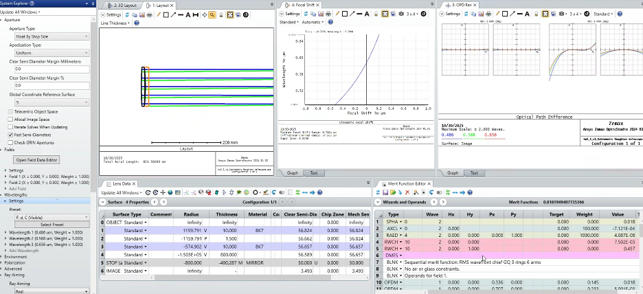
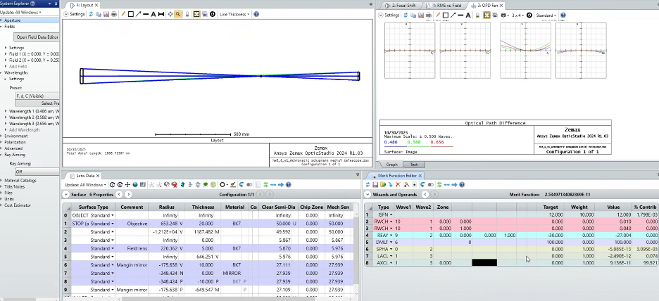

# Reflective and Catadioptric Design Studies

1. Hubble Space Telescope (Ritchey-Chrétien Aplanat)

- **Specs:** F/24 system, 2.4m aperture primary.
- **Design Approach:** Optimized primary and secondary mirror conic constants (Kpri​=−1.0023, Ksec​=−1.4969) to simultaneously eliminate spherical aberration (W040​) and coma (W131​).
- **Outcome:** Achieved aplanatic, diffraction-limited imaging over a ±0.04∘ field.
  

2. Dall Null Compensator (Metrology Design)

- **Specs:** Single BK7 plano-convex lens, 150mm clear aperture.
- **Design Approach:** Configured in a double-pass test setup to simulate the center of curvature testing for the HST primary.
- **Outcome:** Iteratively optimized lens power to reduce primary mirror spherical aberration from 177 waves to **< 4 waves RMS**.
  
  

3. Offner Null Corrector (Advanced Metrology)

- **Specs:** Two-element system featuring a relay lens and a field lens.
- **Design Approach:** Positioned the field lens at the center of curvature to specifically correct for higher-order zonal spherical aberrations.
- **Outcome:** Improved wavefront error by **three orders of magnitude** compared to the single-lens Dall design.
  

4. Schmidt Camera (Aspheric Corrector)

- **Specs:** Wide-field catadioptric system, 100mm pupil.
- **Design Approach:** Aspherized the front surface of a BK7 plate at the stop using 4th-order coefficients; optimized curvature to ensure the 7/10 zone slope was perpendicular to the optical axis.
- **Outcome:** Corrected spherical aberration for a wide-field survey application.
  
  

5. Maksutov & Houghton Telescopes (Achromatization)

- **Maksutov:** Achromatized by optimizing meniscus lens thickness (10mm), reaching a residual focal shift of only **0.0477 μm**.
  
- **Houghton:** Designed an **afocal BK7 doublet** to correct spherical aberration without aspheric surfaces, achieving **0.0075 wave** on-axis RMS error.
  
  

6. Schupmann Medial Telescope (Color Correction)

- **Specs:** F/12 design using only BK7 glass.
- **Design Approach:** Corrected longitudinal color via a Mangin mirror and lateral color through field lens power optimization; utilized all-spherical surfaces to simplify manufacturing.
- **Outcome:** Achieved diffraction-limited performance at ±0.25∘ **off-axis**.

  