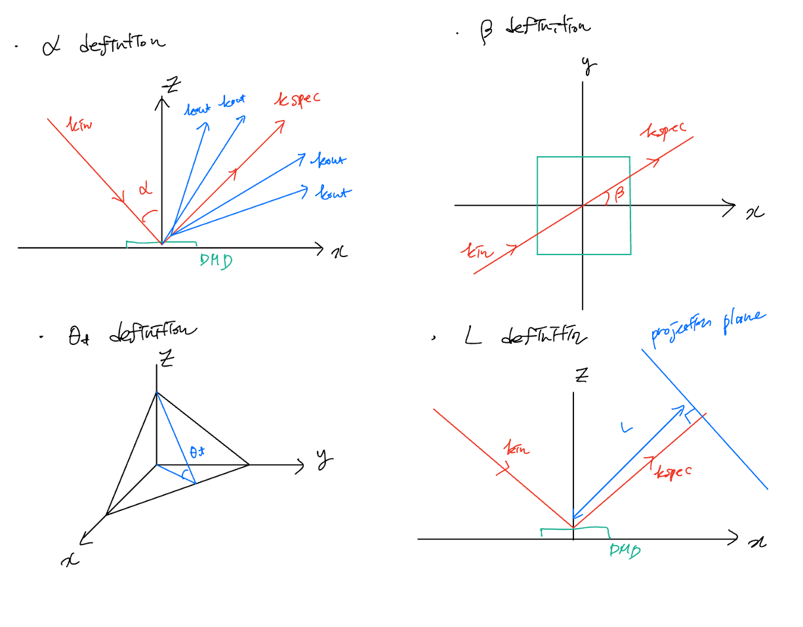
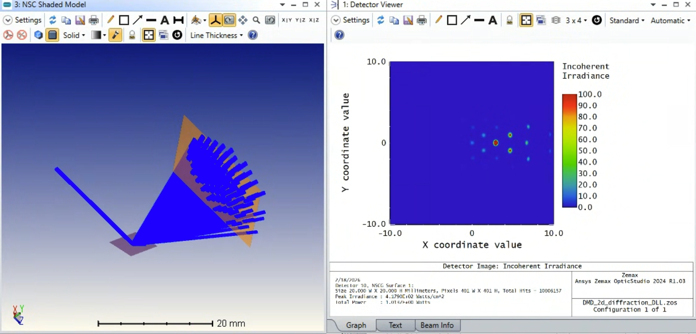
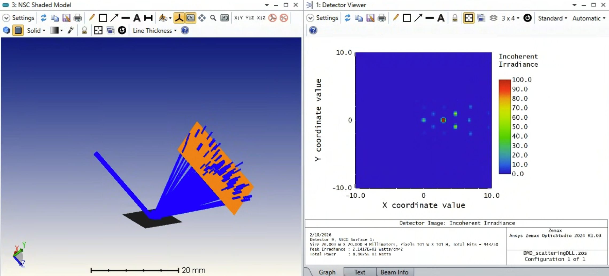
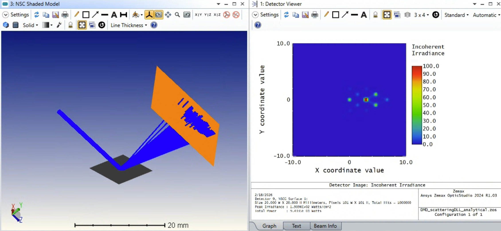
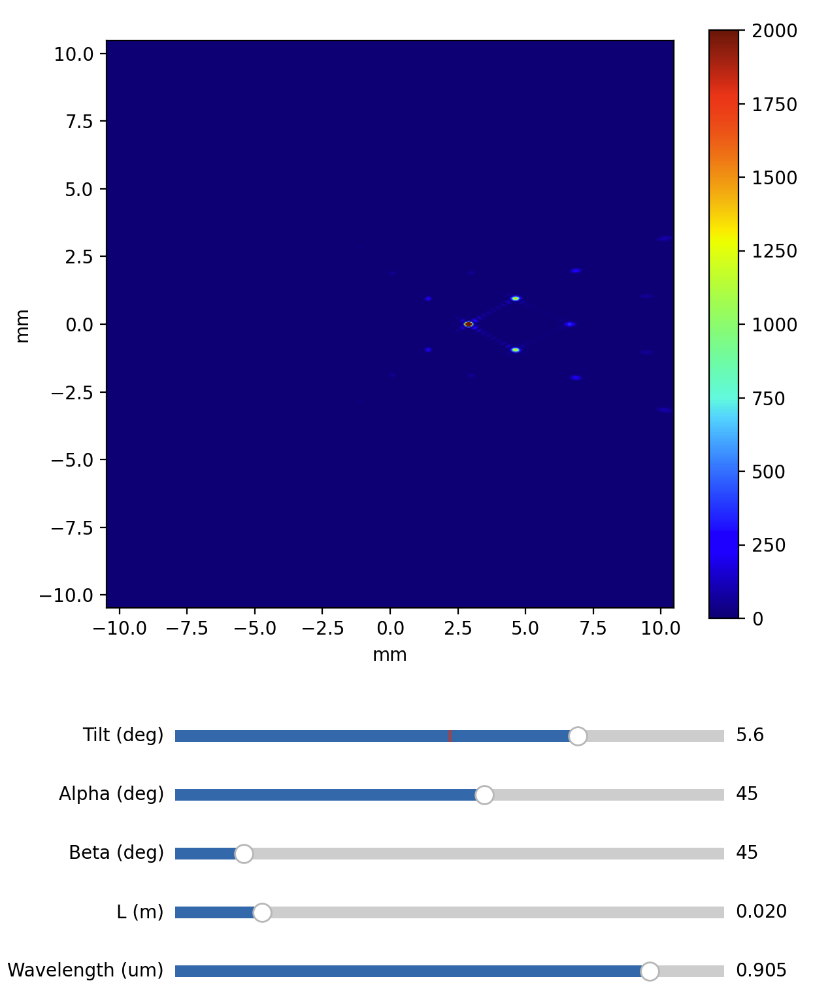
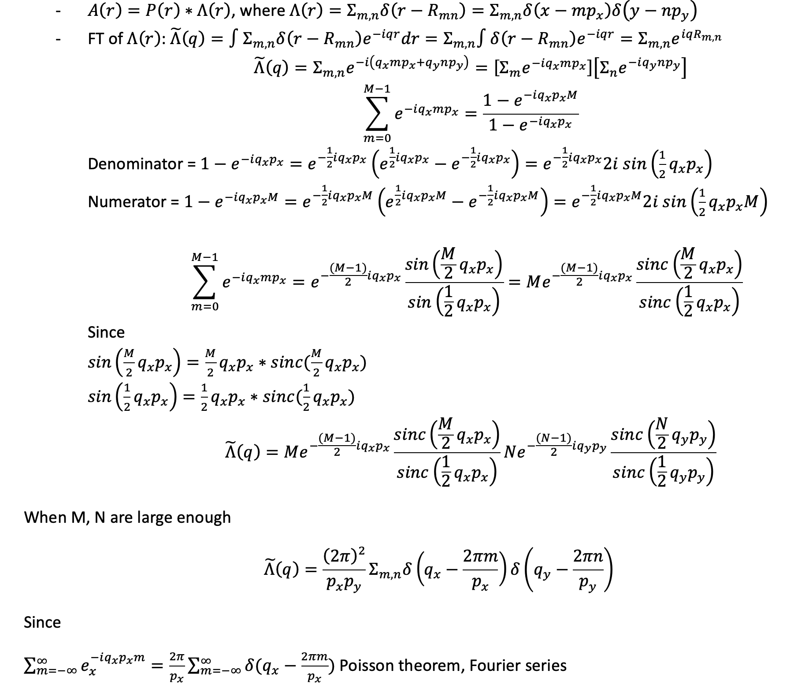
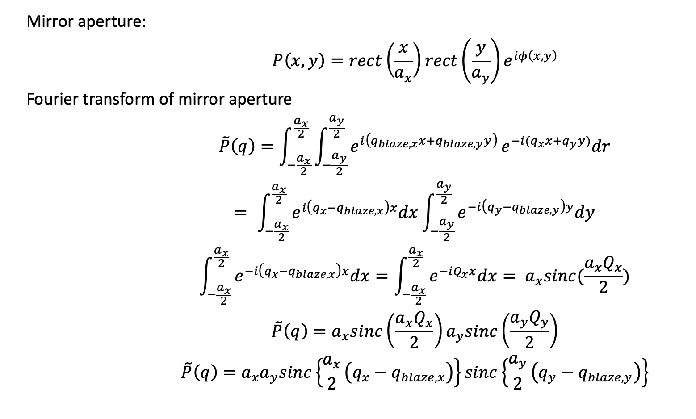
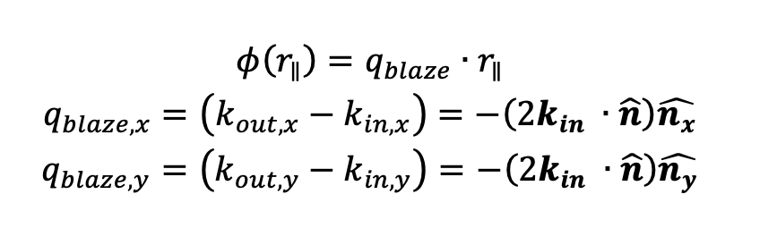
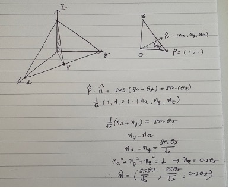

# Modeling DMD Diffraction in Zemax: From Analytical Theory to Implementation
{: .no_toc }

Taehwang Son 
  Last updated: 2026.02.18.

## Table of Contents
{: .no_toc .text-delta }

1. TOC
{:toc}

This article outlines the analytical derivation and Zemax implementation of a Digital Micromirror Device (DMD) diffraction model. For the scope of this derivation, we assume an operation mode where all micromirrors are synchronized in a uniform tilt state.

The primary objective is to predict the positioning and intensity distribution of diffracted orders accurately. It is possible to get its far-field diffraction pattern with numerical calculation using the Fourier transform of the aperture. However, this requires significant computation and does not provide an intuitive understanding of DMD diffraction. Moreover, unlike applications involving arbitrary beam shaping or computer-generated holography (CGH), which require iterative phase retrieval, this model focuses on the fundamental grating physics and the "blaze grating" effect produced by the mechanical mirror tilt.

---

# Analytical Model of DMD Diffraction

## Definitions

The system is modeled as a 2D reflective blazed grating. The interaction between the incident light and the mirror surface is defined by two governing vector conditions. The system is defined by its periodicity (pitch), mirror geometry, and the tilt angles.

### Geometry Constants

- **Pitch:** $p_x, p_y$
- **Mirror Size:** $a_x, a_y$ (where $a < p$)
- **Tilt Angle:** $\theta_t$
- **Wavelength:** $\lambda$
- **Incident Wavevector:** 
$$\mathbf{k}_{in}=k\mathbf{\hat{k}}_{in}=\frac{2\pi}{\lambda}\mathbf{\hat{k}}_{in}$$

As a representative example, the TI DMD 7000 series features a pitch ($p$) of 13.68 µm. Assuming a fill factor of 0.96, the mirror width ($a$) is approximately 13.13 µm. While standard operation employs a binary state ( $\theta_t = \pm12^\circ$ ), this model treats the tilt as a continuous variable, $12 ^\circ \leqq \theta_t \leqq 12^\circ$ .This allows the simulation to account for intermediate transition states or specialized beam-steering applications where the mirror position is modulated between the nominal binary landing states.

### Fundamental Vector Equations

Two governing equations define the DMD mirrors: (1)  grating equation and (2) reflection equation. Here, all DMD mirrors are assumed to have the same tilt angle.

- **The Grating Equation**
The periodicity of the DMD array $(p_x,p_y)$ dictates the discrete angles where constructive interference occurs. The outgoing wavevector $k_{out}$ must satisfy:

$$\mathbf{k}_{out,\parallel} = \mathbf{k}_{in,\parallel} + \mathbf{G}_{mn}, \quad \text{where } \mathbf{G}_{mn} = \left( \frac{2\pi m}{p_x}, \frac{2\pi n}{p_y} \right)$$
- **The Reflection Equation**
The tilt angle  $θ_t$ determines the norma vectorl $\hat n$ of the mirror. This normal defines the **specular reflection vector** kspec, which serves as the center of the diffraction envelope:

$$\mathbf{k}_{spec} = \mathbf{k}_{in} - 2(\mathbf{k}_{in} \cdot \mathbf{\hat{n}}) \mathbf{\hat{n}}$$

---

## Fraunhofer Diffraction Derivation

The far-field complex amplitude $E(\mathbf{k}_{out})$ is the Fourier Transform of the total aperture function $A(\mathbf{r})$.

$E( \mathbf{k_{out}} )=∫A(r) e^{(i \mathbf{(k_{in}-k_{out} )r}}) dr=∫A(r) e^{(i\mathbf{qr)}} dr,$ 

where $A(r)$ is a complex aperture function, $\mathbf{q}=\mathbf{k_{in}-k_{out}}$ and $E(\mathbf{k_{out}} )=\tilde {A}(\mathbf{q})$.

### Fraunhofer Approximation

A critical consideration in DMD diffraction modeling is the Fraunhofer distance ($L \gg D^2/\lambda)$ . In practice, the effective aperture diameter D is defined by the **incident beam diameter** rather than the physical boundaries of the DMD chip itself.

The distance required to reach the far-field quadratically with the number of mirrors involved in the diffraction. Taking a TI 7000 DMD (13.68 μm pitch) and a wavelength of λ=905 nm as an example:

| **Case**       | **Beam Diameter (D)** | **Number of Mirrors**      | **Fraunhofer Distance ($D^2/λ$)** |
| -------------- | --------------------- | -------------------------- | --------------------------------- |
| **Small Beam** | 1.37 mm               | $\approx 100 \times 100$   | $\approx 20  cm$                  |
| **Large Beam** | 13.7 mm               | $\approx 1000 \times 1000$ | $\approx 2  m$                    |

### The Total Aperture Function

The DMD is modeled as a convolution of a single mirror's profile $P(\mathbf{r})$ with a finite 2D Dirac comb $\Lambda(\mathbf{r})$:

$A(\mathbf{r}) = P(\mathbf{r}) * \sum_{m=0}^{M-1} \sum_{n=0}^{N-1} \delta(\mathbf{r} - \mathbf{R}_{mn})$

where 
$\mathbf{R}_{mn} = (mp_x, np_y).$

### The Lattice Factor

The Fourier Transform of the Dirac comb $\tilde{\Lambda}(\mathbf{q})$ yields the interference term. For $M, N$ mirrors:

$\tilde{\Lambda}(\mathbf{q}) = \sum_{m=0}^{M-1} e^{-i q_x m p_x} \sum_{n=0}^{N-1} e^{-i q_y n p_y}$

Using the geometric series identity, the resulting intensity contribution is:

$\vert\tilde{\Lambda}(\mathbf{q})\vert^2 =  \vert \frac{\sin(M q_x p_x / 2)}{\sin(q_x p_x / 2)} \vert^2 \vert \frac{\sin(N q_y p_y / 2)}{\sin(q_y p_y / 2)} \vert^2$

Assuming that we have enough mirrors ($M,N → \infty$), $\tilde{\Lambda}(\mathbf{q})$ can be approximated to delta comb}

 $\tilde{\Lambda}(\mathbf{q}) = \frac{(2\pi)^2}{p_x p_y} \sum_{m,n} \delta\left(q_x - \frac{2\pi m}{p_x}\right) \delta\left(q_y - \frac{2\pi n}{p_y}\right)$

### The Single Mirror Factor (Diffraction Envelope)

The tilted mirror introduces a phase ramp $\phi(x,y)$. Given the mirror normal $\mathbf{\hat{n}}$for a diagonal tilt:

$$\mathbf{\hat{n}} = \left[ \frac{\sin \theta_t}{\sqrt{2}}, \frac{\sin \theta_t}{\sqrt{2}}, \cos \theta_t \right]$$

The phase gradient results in a shifted sinc envelope. We define the blaze vector $\mathbf{q}_{blaze}$ as the momentum transfer at specular reflection:

$$\mathbf{q}_{blaze} = - 2(\mathbf{k}_{in} \cdot \mathbf{\hat{n}}) \mathbf{\hat{n}}$$

The single mirror transform is:

$$$\tilde{P}(\mathbf{q}) = a_x a_y \text{sinc}\left( \frac{a_x (q_x - q_{blaze,x})}{2} \right) \text{sinc}\left( \frac{a_y (q_y - q_{blaze,y})}{2} \right)$$

### Total Intensity Distribution

The final intensity $I(\mathbf{q})$ is the product of the single-mirror envelope and the lattice factor:

$I(\mathbf{q}) = {\vert\tilde{P}(\mathbf{q})\vert^2} ({\text{Envelope}}) \times {\vert\tilde{\Lambda}(\mathbf{q})\vert^2} ({\text{Lattice Factor}})$

$I(\mathbf{q}) =  a_x a_y \text{sinc}\left( \frac{a_x (q_x - q_{blaze,x})}{2} \right) \text{sinc}\left( \frac{a_y (q_y - q_{blaze,y})}{2} \right) \times \vert \frac{\sin(M q_x p_x / 2)}{\sin(q_x p_x / 2)} \vert^2 \vert \frac{\sin(N q_y p_y / 2)}{\sin(q_y p_y / 2)} \vert^2$
 

 Physical Interpretation

- **The Grid:** The $\sin(N\dots)/\sin(\dots)$ terms create a fixed grid of diffraction spots in angular space, determined solely by the pitch $p$ and $\lambda$.
- **The Brightness:** The $sinc$ terms determined brightness. As the mirror tilts ($\theta_t$ changes), the $sinc$ envelope slides over the grid, illuminating different diffraction orders.

---

## Python Implementation

Many diffraction grating papers are based on far-field projections because the diffraction angle calculation is a major concern.  Instead, projection onto a plane perpendicular to $k_{spec}$ and real coordinates are used for python implementation to match results with Zemax later. 

The implementation employs a vector-based planar intersection ****method that treats the observation screen as a 3D flat plane perpendicular to the specular reflection vector. By calculating a scaling factor based on the ray's directional cosine relative to the screen normal ($scale=L/(\hat k⋅ \hat z_h)$), the code accurately maps angular diffraction data into physical "mm" coordinates while naturally accounting for geometric distortion at high angles.

- Variable definitions

The simulation provides five degrees of freedom via interactive sliders, enabling a sensitivity analysis of the diffraction system:

- **Tilt Angle (θt):** Shifts the sinc envelope relative to the fixed interference grid.
- **Incidence Angles (α,β):** Rotates the incident wavevector $k_{in}$, affecting both the location of the specular reflection and the projected spacing of the grating orders.
- **Observation Distance (L):** Scales the physical "mm" footprint of the pattern on the screen.
- **Wavelength (λ):** Directly scales the angular divergence of the grating orders and the width of the central blaze.

### Python interactive diffraction simulation

To validate the analytical model, the total intensity distribution $I(q)$ was implemented in a Python-based interactive simulation. This tool allows for real-time visualization of how the diffraction pattern evolves under different physical and geometric constraints. TI DMD 7000 spec was employed.

[https://dmd-simulation-jw3t5pa5p6y7aqvsocwrzn.streamlit.app/?embed=true](https://dmd-simulation-jw3t5pa5p6y7aqvsocwrzn.streamlit.app/?embed=true)

### Python interactive phase matching condition

To illustrate the physical peak of diffraction efficiency, the simulation visualizes the Phase Matching Condition:

**$G_{mn}=q_{blaze,∥}$**

The implementation distinguishes between two variables:

1. **The Lattice (G*mn*):** Represented by red dots, these fixed points define the discrete angles where constructive interference is possible based on the grating equation: $k_{out,\parallel}=k_{in,\parallel}+2\pi/p(m,n)$ .
2. **The Blaze Center (q*blaze*):** Represented by the blue dot, this tracks the specular reflection direction: **$k_{spec}=k_{in}−2(k_{in}⋅\hat {n}) \hat {n}$**

By adjusting the sliders, the user can observe how the energy envelope (the blue dot) shifts across the stationary grating orders. Maximum efficiency is reached when the blue dot overlaps with a red dot, satisfying the phase-matching condition for a specific (*m*,*n*) order.

[https://dmd-simulation-mlbegwhffsk9tjetaaaqz5.streamlit.app/?embed=true](https://dmd-simulation-mlbegwhffsk9tjetaaaqz5.streamlit.app/?embed=true)

## Zemax DLL generation

A DMD can be modeled in Zemax Sequential Mode for incoherent applications, such as DLP projectors. In this configuration, the DMD acts as a reflective grating where individual diffraction orders are isolated using the Multi-Configuration Editor. This method uses a geometrical ray trace and ignores interference, making it ideal for standard lens design and throughput studies.

For coherent light sources used in beam steering or holographic displays, light diffracts into multiple discrete orders simultaneously. Capturing this behavior requires Non-Sequential Mode (NSC). Because a DMD functions as a blazed grating with a dynamic tilt, a custom DLL is necessary to calculate diffraction efficiency relative to the mirror's specific blaze state

The following table summarizes three distinct methods for modeling a DMD in Non-Sequential Mode.

| Feature | 1. Diffractive DLL | 2. Scattering DLL (Delta Approximation) | 3. Scattering DLL (Full Analytical) |
| :--- | :--- | :--- | :--- |
| **DLL Type** | Diffractive DLL (non-sequential) | Surface Scatter DLL (non-sequential) | Surface Scatter DLL (non-sequential) |
| **Ray Behavior** | **Deterministic.** One input = One output (Zemax does iteration for diffraction orders) | **Probabilistic.** One input splits into discrete orders($m_x, m_y$) by the envelope weighting | **Probabilistic.** Continuous sampling; rays can land anywhere. |
| **Visual Ray Density** | **Constant.** High-power and low-power rays look identical. | **Variable.** More rays appear at high-efficiency integer orders without side lobes. | **Variable.** More rays appear at high-efficiency integer orders with side lobes |
| **Best Use Case** | Precision throughput and lens optimization. | Visualizing ray paths and mechanical clipping of orders. | stray light analysis between orders. |
| **Speed** | **Fastest.** No random searching required.  < 10s for ray trace | **Medium.** Fast because it only checks specific integers.  < 1 min for ray trace | **Slowest.** High rejection rate in Monte Carlo sampling.  > a few minutes for ray trace |

* Simulation speed can depend on PC specs. (PC spec used, CPU: Intel i3-i8130U RAM: 8GB) 

The screenshots below show the Zemax implementation across the different DLL settings. While all three methods produce a Detector Viewer output that aligns closely with my Python reference models, they differ significantly in their visual and computational behavior.

As the comparison table suggests, the Diffractive DLL produces an unnatural, constant ray density in the layout. The number of ray bundles is strictly tied to the maximum order set in the interface rather than the physical intensity. In contrast, the Scattering DLL (Delta Approximation) provides a much more intuitive result, where the ray density visually scales with the diffraction efficiency. I have hard-coded a range of ±10 orders into the DLL, which should be sufficient for the vast majority of DMD applications.

The Full Analytical scattering implementation is technically the most accurate model, as it accounts for the finite size of the mirror array and the light distribution between orders. However, the simulation speed is significantly slower due to the nature of the Monte Carlo sampling. This mode is not recommended for general design work. It should be used only for specialized cases like stray light or contrast analysis.

### Diffractive DLL

[Diff2D_DMD_250216_v2.dll](Diff2D_DMD_250216_v2.dll)

### Scattering DLL (Delta Approximation)

[Scattering_DMD_250217_v3.dll](Scattering_DMD_250217_v3.dll)

### Scattering DLL (Full Analytical Model)

[Scattering_DMD_analytical_250218_v2.dll](Scattering_DMD_analytical_250218_v2.dll)

### Reference Python Result

## Reference

A similar derivation was found in some references

- Deng et al.,  "Maximizing energy utilization in DMD-based projection lithography," Opt. Express 30, 4692-4705 (2022)
- S. M. Popoff et al., “A practical guide to digital micro-mirror devices (DMDs) for wavefront shaping” J. Phys. Photonics, 6, 043001 (2024)
- S. Scholes et al., "Structured light with digital micromirror devices: a guide to best practice," *Optical Engineering* 59(4), 041202 (2019).

References for Zemax implementation 

[Simulate 2D diffraction grating using customized diffractive DLL](https://community.zemax.com/dlls-11/simulate-2d-diffraction-grating-using-customized-diffractive-dll-113)
[Custom DLLs in OpticStudio: An overview of user-defined surfaces, objects, and other DLL types](https://optics.ansys.com/hc/en-us/articles/42661741799699-Custom-DLLs-in-OpticStudio-An-overview-of-user-defined-surfaces-objects-and-other-DLL-types)

References for DMD diffractive beam steering

- https://youtu.be/k3DWbPGgGI0?si=4dwAUiu2Rv6VboJi
- J. Chan et al., "Flash and point-and-shoot hybrid lidar by DMD-based solid-state diffractive beam and image steering," Opt. Express 33, 19650-19663 (2025)
- Nero, Gregory, et al. "Two-dimensional solid-state diffractive beam steering by digital micromirror devices." Emerging Digital Micromirror Device Based Systems and Applications XVI. Vol. 12900. SPIE, 2024.

## **Appendix**

### 1. Derivation of Lattice Factor

### 2. Derivation of Single Mirror Factor

- $q_{blaze}$ definition

- Mirror normal vector $\hat {n}$ definition

