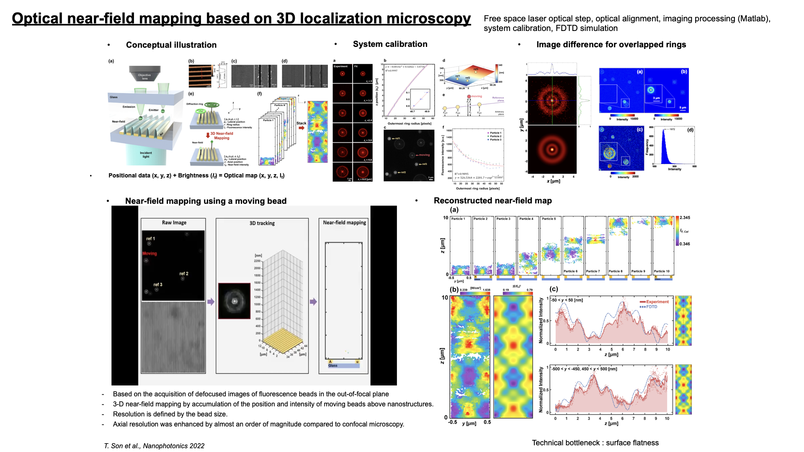

# Super-Resolved 3D Optical Metrology: Near-Field Mapping 

This project introduced Defocused Point Localization Mapped Accumulation (DePLOMA), a high-precision method for mapping 3D optical near-fields by tracking emitters in a liquid medium. By leveraging wave optics and diffraction physics, the system bypasses the traditional axial resolution limits of far-field microscopy. This research was published in [Nanophotonics](https://www.degruyterbrill.com/document/doi/10.1515/nanoph-2022-0546/html).

**Optical Design & Engineering Innovation**

- **Defocused Imaging Principle:** The system utilizes the linear relationship between the Outermost Ring Radius of an emitter's diffraction pattern and its axial position (z).
- **High-Precision Localization:** Implemented a custom MATLAB pipeline using **l**east-square fitting of multi-concentric Gaussian functions to achieve a lateral precision of 3.95 nm and an axial precision of 7.74 nm.
- **System Architecture:** Developed on an inverted microscope platform featuring a 1.49 NA TIRF objective, an EM-CCD for high-speed acquisition (10 fps), and a motorized nanostage for fine focus control.
- **Refractive Index Compensation:** Applied the Gibson and Lanni model to correct for OPL mismatches between immersion and sample layers, ensuring accurate 3D coordinate extraction.
  

**Metrology Performance**

- **Resolution Enhancement:** Achieved an axial resolution boost of >6x compared to diffraction-limited Confocal Laser Scanning Microscopy (CLSM).
- **3D Field Mapping:** Validated the system by reconstructing the 3D intensity distributions of gold nanoslits (100–700 nm), showing excellent agreement with FDTD numerical simulations.
  
  
  

  **Technical Competencies Demonstrated:**

- **Near-Field Optics:** Mapping evanescent and radiative fields with sub-wavelength precision.
- **Computational Imaging:** Gaussian ring fitting, refractive index mismatch correction, and 3D point cloud accumulation.
- **Precision Metrology:** Achieving sub-10 nm 3D localization using far-field optical hardware.
- **Advanced Optical Setups:** High-NA TIRF objectives, EM-CCD integration, and nanostage automation.

